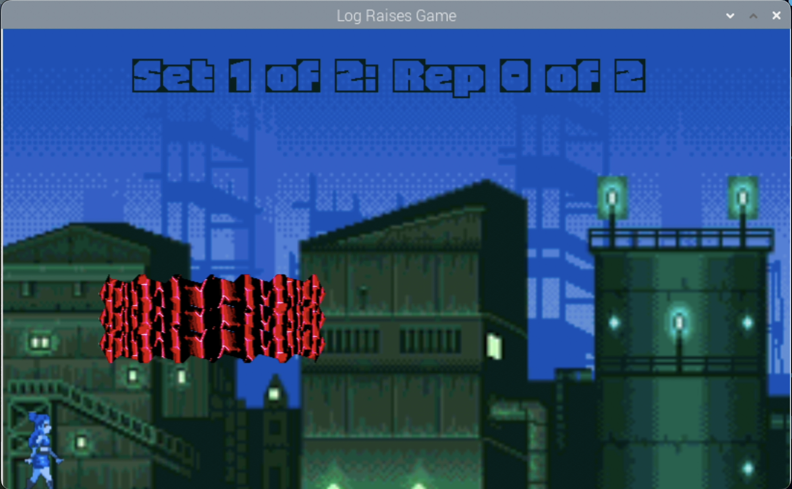

# Project: Arcadence (Virtual Fitness Trainer)

Project for 3.007 Design Thinking and Innovation

## Problem Statement
How might we enhance the workout experience at the outdoor fitness corner in the evening for SUTD students?

## Proposed Solution
As the current layout of the SUTD Fitness Corner does not maximise the full available area (bounded by trees and the SUTD Field fence), and our solution requires a substantial area to implement, we propose to expand the SUTD FItness Corner to the above region from 255.19m2 to 385.12m2.

To foster social interaction, we also propose to redesign and gamify the fitness stations. For instance, the lunges stepping stones will be redesigned from separate rectangular stepping blocks to a circle to encourage interaction between concurrent users. Furthermore, each station will have its own unique game to incentivise users to try out every station and as a result train their different muscle groups.

### Programming Aspects
This repository contains both a proof of concept for a gamified log raise fitness station and a web user interface for the fitness corner's command centre.

### Screenshots

### Videos

## Credits
2024 Cohort 2 Group 1 - 12 Cents (including Akash, John, Magnus, Sanshray, Stanley and I)
Sanshray: Game artstyle